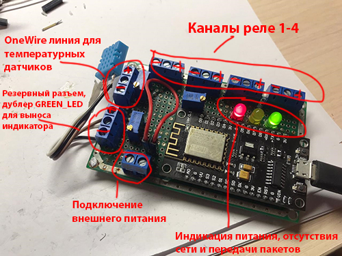

# nmcu-garage-controller
Контроллер для гаража на базе ESP8266. Включает в себя программу для контроллера и веб-интерфейс управления и мониторинга системы. 
В папке nmcu-garage-controller находится серверная часть. 
Файл прошивки nmcu-garage-controller.ino предназначен для заливки в NodeMCU. 

# Подключение
 
GPIO13 используется для подключения датчиков DS18B20. В программе идет обработка до 10 датчиков. Расширить достаточно легко, ограничения стандартные для данной шины. 
На GPIO12 подключается желтый светодиод (индикация попытки подключения к сети) 
На GPIO14 подключается зеленый светодиод (мигает в такт отправке пакетов на сервер) 
GPIO5, GPIO4, GPIO0, GPIO2 соответствуют каналам реле 1,2,3,4 
В самом начале программы необходимо настроить некоторые константы 
const char* ssid     = "ИМЯ_WiFi_СЕТИ"; 
const char* password = "ПАРОЛЬ_WiFi_СЕТИ"; 
const char* host = "your_domain.com";  
